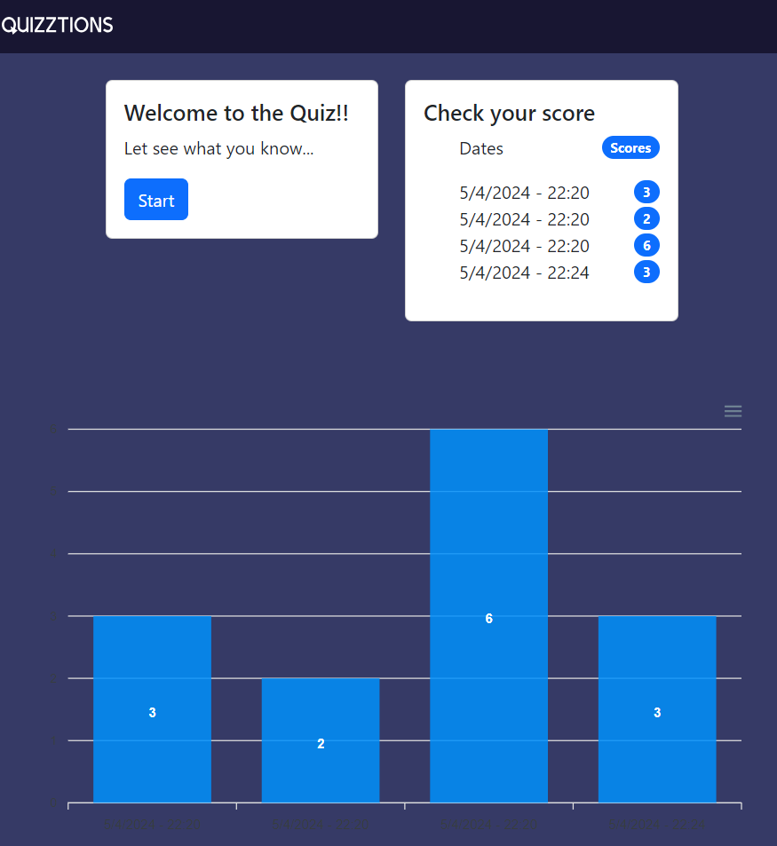

# proyecto-quiz

Proyecto para clases en TheBridge sobre un QUIZ!

## Descripción

El proyecto consta de una pagina web con un quiz de 10 preguntas, donde podras ver los resultados obtenidos, y volver a realizar el Quiz cuantas veces quieras, y luego podras comparar tus resultados. El tema de las preguntas, es "conocimiento general".

## Visuales

## Empezando 🚀

Estas instrucciones te guiarán para obtener una copia de este proyecto en funcionamiento en tu máquina local para propósitos de desarrollo y pruebas.

### Prerrequisitos 📋

Lista de software y herramientas, incluyendo versiones, que necesitas para instalar y ejecutar este proyecto:

-    Cualquier Sistema Operativo
-    Javascript
-    Boostrap
-    Apexcharts
-    Axios

## Construido Con 🛠️

-    [Boostrap](https://blog.getbootstrap.com/2024/02/20/bootstrap-5-3-3/) - El framework web utilizado
-    [Apexcharts](https://apexcharts.com/docs/installation/) - Modern & Interactive Open-source Charts
-    [Axios](https://axios-http.com/es/docs/intro) - Cliente HTTP basado en promesas

## Contribuyendo 🖇️

Repositorio de Carlota con la contribucion de Arnold

## Soporte

Si tienes algún problema o sugerencia, por favor abre un problema [aquí](https://github.com/CarBlank/proyecto-quiz/issues).

## Versionado 📌

Usamos [Git](https://git-scm.com) para el versionado. Para las versiones disponibles, ve las [etiquetas en este repositorio](https://github.com/CarBlank/proyecto-quiz.git).

## Autores ✒️

-    **Carlota** - _Trabajo inicial_ - [CarBlank](https://github.com/CarBlank)
-    **Arnold** - _Trabajo inicial_ - [Arnoldm94](https://github.com/arnoldm94)

Mira también la lista de [contribuidores](https://github.com/CarBlank/proyecto-quiz/contributors) que han participado en este proyecto.

## Expresiones de Gratitud 🎁

Estamos agradecidos por las contribuciones de la comunidad a este proyecto. Si encontraste cualquier valor en este proyecto o quieres contribuir, aquí está lo que puedes hacer:

-    Comparte este proyecto con otros
-    Invítanos un café ☕
-    Inicia un nuevo problema o contribuye con un PR
-    Muestra tu agradecimiento diciendo gracias en un nuevo problema.

---
